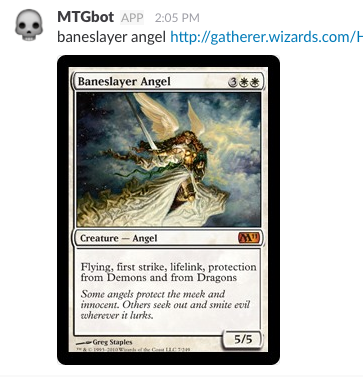

## What You'll Need
*   A [Slack account](https://slack.com/)

## Step 1: Add a Slash Command Configuration
On the [Slash Commands](https://slack.com/apps/A0F82E8CA-slash-commands) page select 'Add Configuration', set the Slash Command you want to use, for our example app, this should be `/count`. You can set it to anything, so long as you update the handler for it too in the project (see below). For the 'URL' value, use your project's publish URL (Click 'Show'), this has the format 'https://project-name.glitch.me', so in our example app it is 'https://slash-command.glitch.me'. Leave the method to the default 'POST' value and set the other values as you need to, but be sure to copy the Token value for use in the next step.

## Step 2: Copy the Command Token
Copy the token value for the Slash Command into the `.env` file in your  project. You'll see an entry for SLACK_TOKEN. Paste the token against that variable name.

## Screenshot

